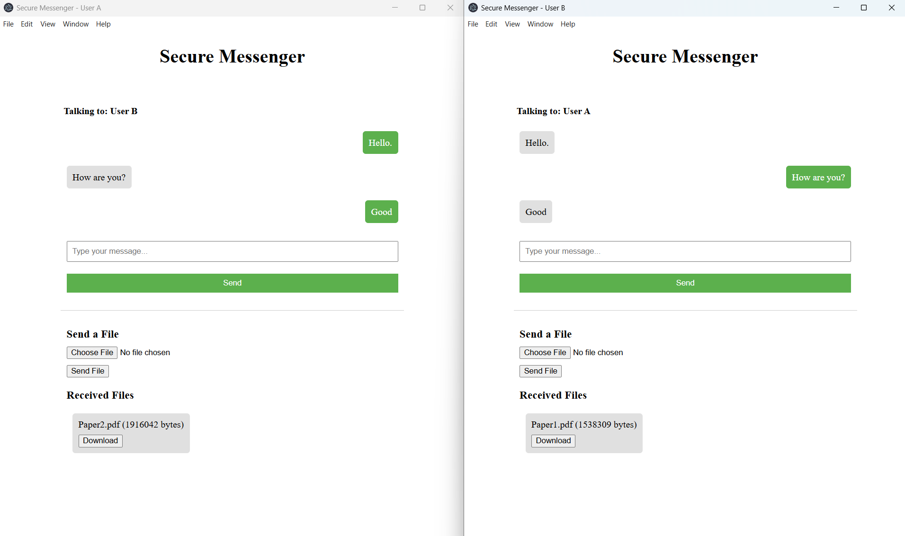

# Secure-Messenger-Signal
Cybersecurity Capstone Project: a secure messaging and file transfer prototype that provides confidentiality, integrity, and authentication through implementation of the Signal Protocol and additional server authentication mechanisms. 

This application was developed using TypeScript, HTML, and CSS. 



## Security Features
- End-to-end encryption (AES-256-GCM)
- Secure file transfer functionality
- Signal Protocol integration
- Certificate-based server authentication

## Security Properties
- Confidentiality and integrity of both messages and files
- Authentication of the communicating parties and server
- Forward secrecy
- Post-compromise security

## Runtime and Libraries Used
- Node.js
- Electron
- Express
- `fs`
- `https`
- `@privacyresearch/libsignal-protocol-typescript`
    
## Notable Limitations 
- Employs a trust-on-first-use (TOFU) authentication policy
- Large file transfer not optimized (file chunking unsupported)
- Asynchronous messaging functionality not implemented
- Prototype intended for educational and demonstration purposes

## Instructions to Run Prototype
Before first run, generate a local certificate authority and server certificate. Then, place the following files in a `certs/` directory located at the project root:
  
- `ca-cert.pem`
- `server-cert.pem`
- `server-key.pem`
    
Then:
  
1. Open two terminal instances
2. In the first terminal, run:
```
npm run server
```
3. In the second terminal, run:
```
npm run start
```

Upon execution, two Electron application windows will appear. Each window represents a separate user instance identified by the window header. Users may securely exchange encrypted messages and files through the provided interface. 
